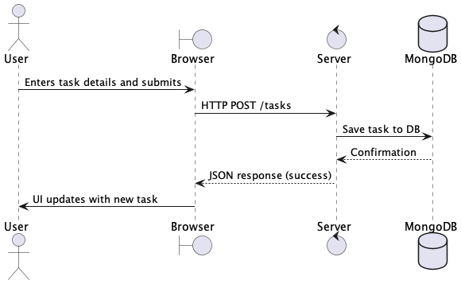

# Week 10 Workshop – Group Web Application Project

## Step 1: Define Web Application

**Project Title:** TaskNest – A Shared Task Manager for Busy Students

**What problem does the app solve?**  
Many students and young professionals struggle to manage shared responsibilities effectively, especially in group projects or shared living spaces. TaskNest helps users track, assign, and complete collaborative tasks while improving accountability and communication.

**Who are the target users?**  
- University students working on group assignments  
- Flatmates managing shared chores  
- Young professionals collaborating on small team projects

**What are the key features?**  
- Create and join shared task boards  
- Assign tasks with due dates, tags, and priority levels  
- Mark tasks as completed and comment on progress  
- Real-time updates and notifications  
- Mobile-friendly responsive design  

---

## Step 2: Analysis of Web Application

### Functional Requirements
1. Users can register, log in, and manage accounts  
2. Users can create or join shared task boards  
3. Users can create, assign, complete, and comment on tasks

### Non-Functional Requirements
1. **Usability:** The app must work smoothly on both desktop and mobile devices with clear, intuitive UI  
2. **Performance:** The backend should handle requests within 1–2 seconds under normal usage conditions  

---

## Step 3: Estimate Timeline

### Team Members and Responsibilities
- **Mustafa Abdalla (Frontend):** Landing page, task UI, responsive layout  
- **Anum Anum Taliya (Backend):** Authentication, task APIs  
- **Sebastian Edler (Database + Deployment):** MongoDB models, deployment setup  

### Breakdown (Example: Sebastian Edler – Database + Deployment)
- Setup MongoDB schema and Mongoose models (3 hours, Week 10 Mon)  
- Connect models to Express routes (3 hours, Week 10 Tue)  
- Configure deployment environment (2 hours, Week 11 Mon)  
- Test and refine database queries (2 hours, Week 11 Wed)  

### Timeline
| Week | Goal |
|------|------|
| 10   | Plan app, design schema, start frontend/backend setup |
| 11   | Complete core features, integrate frontend/backend |
| 12   | Testing, UI polish, deployment, presentation prep |

---

## Step 4: Web Stack Plan

| Layer       | Tools |
|-------------|-------|
| **Frontend** | HTML, CSS, JavaScript, optionally React |
| **Backend**  | Node.js with Express |
| **Database** | MongoDB (via Mongoose) |
| **Communication** | HTTP using Fetch API (JSON format) |

---

## UML Sequence Diagram

### Sequence Overview:
1. User submits new task via browser  
2. Browser sends HTTP POST request to server  
3. Server validates data and saves to MongoDB  
4. Server sends success response  
5. Browser updates task list without reload  

---

## GitHub Project Board

- ✅ GitHub repo created and collaborators added  
- ✅ GitHub Project board created with columns: Backlog, Ready, In Progress, In Review, Done  
- ✅ Each task added as an issue and assigned to relevant team member  
- ✅ Issues moved across columns to track real progress

---

## Notes
- [ ] Upload final UML diagram as `diagram.png`  
- [ ] Confirm GitHub repo link is in README  
- [ ] Continue updating issues and moving tasks across the board  